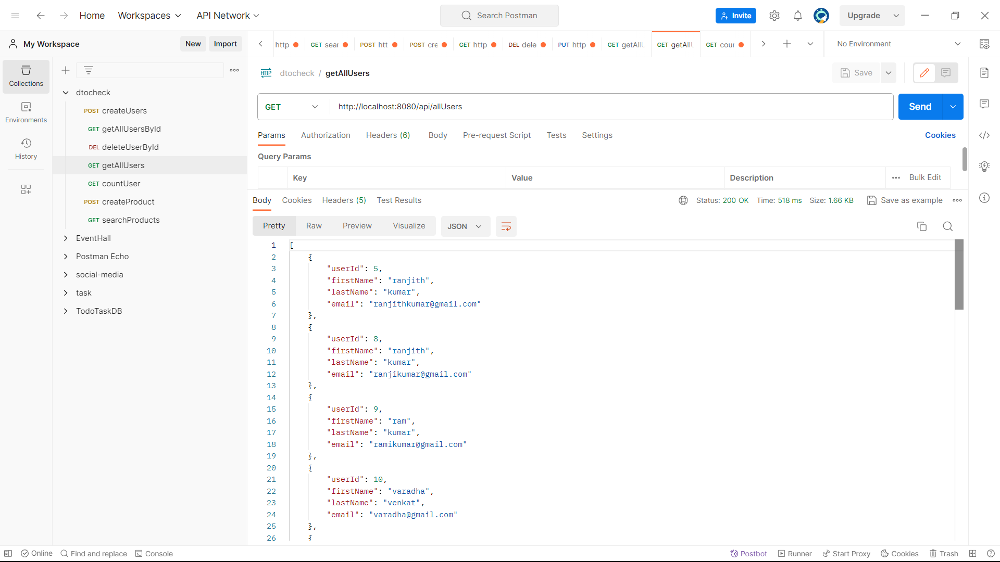
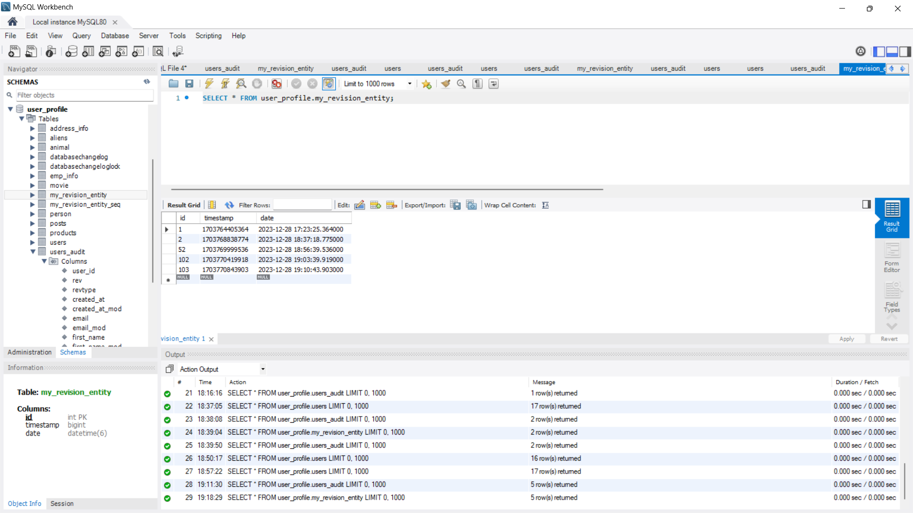

#### Trainer Name : Mr.Naresh
#### Trainee Name : Kamesh A

# Implement the given below 👇 concepts in this Repository.
# DTO
## what is DTO?
DTO stands for Data Transfer Object. DTO is a plain java object that is used to transfer data between different layers(client and server)
## uses of DTOs
**Security & Privacy:** By using DTOs you can selectively expose and filter the data,
preventing sensitive information.**(hide user password field) because password is sensitive data so this password field don't show anyone**
### For Example:

Look this Image I avoid password field beacuse user password is sensitive data. so I used and implemented DTO(Data Transfer Object) concept.

# Swagger
## what is swagger?
Swagger is an Opensource api Documentation Framework.
Swagger is used for documenting the REST APIs.
Swagger is primarily used for API Design , API Documentation and API Testing.
It provides a user interface to access our RESTful web services via web browser.
## how to implement swagger in spring boot?
**Step 1:** Add swagger dependency in your pom.xml file
```xml
<dependency>
    <groupId>org.springdoc</groupId>
    <artifactId>springdoc-openapi-starter-webmvc-ui</artifactId>
    <version>2.0.2</version>
</dependency>
```
**Step 2:** Run your spring boot application and then **Go to your browser and Navigate to:**
```
http://localhost:8080/swagger-ui.html
```

**Step 3:** Hit this URL(http://localhost:8080/swagger-ui.html) and see your swagger output


# Exception Handling in Spring Boot : Using @RestControllerAdvice & @ExceptionHandler
**@RestControllerAdvise** is used to create a global exception handler that returns JSON(javascript object notation) and XML response.
**@ExceptionHandler** annotation indicates which type of exception we want to handle. 
### How to Implement @RestControllerAdvice and @ExceptionHandler?
```java
@RestControllerAdvice
public class GlobalExceptionHandler {
    @ResponseStatus(HttpStatus.BAD_REQUEST)
    @ExceptionHandler(ProductNotFoundException.class)
    public Map<String, String> handleProductNotFound(ProductNotFoundException e) {
        Map<String, String> errorMap = new HashMap<>();
        errorMap.put("error Message", e.getMessage());
        return errorMap;
    }
}
```
### For Example

Look this Image, I search Keyboard Product but Keyboard Product is not exist.so I handle Global Exception Handler(**@RestControllerAdvice** **@ExceptionHandler**)

# Implement a Search Feature REST api with Sql LIKE Operator in Spring Boot
### How to Implement Search Feature?
```
 public List<Product> user_filter_search_products(String query) throws ProductNotFoundException {
        String splitWord = query.substring(0,3);
        String jpql = "SELECT p FROM Product p WHERE p.productName LIKE :searchTerm";
        TypedQuery<Product> typedQuery = entityManager.createQuery(jpql,Product.class);
        typedQuery.setParameter("searchTerm",splitWord+"%");
        List<Product> resultList =  typedQuery.getResultList();

        if(resultList.isEmpty()){
            throw new ProductNotFoundException("Product Not Available");
        }
        return resultList;
    }
```
### For Example:
.png)
Look this Image, I Search Airpods Items Return List of all AirPods Record.Because I Implement Search Feature REST Api with **SQL (LIKE) Operator.**

# SonarLint
### what is sonarLint?
SonarLint is an IDE(Integrated Development Environment) Extension.
SonarLint helps you detects and fix quality issues as your write code.
SonarLint helps you maintain code quality.SonarLint like a Spell Checker.


# Implement HQL Aggregate Queries using SpringBoot
Hibernate Query Language(HQL) supports various aggregate functions - **min(), max(), sum(), avg(),count()** in the SELECT statement.
An aggregate function performs a calculation on a set of values, and returns a single value.

### How to Implement Aggregate Function in SpringBoot?
##### count():
```java
  public long countUsers(){
        String count_query = "SELECT COUNT(u.userId) FROM User u";
        Query query = entityManager.createQuery(count_query);
        return (long) query.getSingleResult();
        }
```
### For Example:
.png)

In This Example I have user table but I don't know How many no.of users available in the user table. so I Implement **HQL-count()** Aggregate Function.Finally I Get accurate result for  number of user available in the user table.

# EntityManager using SpringBoot
### what is EntityManager?
EntityManager is a Lower-level interface that is part of the Java Persistence API(JPA).
It Provides a set of methods for managing the lifecycle of persistent entities, Including creating,
updating, and deleting entities.

### How to Implementation of EntityManager via CRUD Operation in SpringBoot?
##### how create and store data to the database table:
```java

    @Autowired
    EntityManager entityManager;


    @Transactional
    public void createUsers(User user){
        entityManager.persist(user);
    }
```
#### For Example:

#### How to get specific data by using id:

```java
    import org.springframework.beans.factory.annotation.Autowired;

    @Autowired
    EntityManager entityManager;
    public User findById(int id){
        return entitymanager.find(User.class ,id)
    }
```
#### For Example:

#### how to update specific data by using id:

```java
import org.springframework.beans.factory.annotation.Autowired;

@Autowired
EntityManager entityManager;
@Transactional
@PutMapping("/update/users/{id}")
public User updateUserRecord(@PathVariable("id") long id,@RequestBody User user){
        User user1 = entityManager.find(User.class,id);
        if(user1!=null){
            return entityManager.merge(user);
        }else{
            throw new RuntimeException();
        }
}
```
#### For Example:

#### how to remove specific data by using id:

```java
import jakarta.transaction.Transactional;

@Transactional
public void deleteById(int id){
        User user=entityManager.find(User.class,id);
        entityManager.remove(user);
}
```
#### For Example:

#### how to get all records:
```java
    public List<User> getAllData() {
        String jpql = "SELECT e FROM User e";
        Query query = entityManager.createQuery(jpql, User.class);
        return query.getResultList();
    }
```
#### For Example:


# Spring Scheduling(cron job)
### what is Spring Scheduling?
Scheduling is a process of executing the task for the specific time period.

**step 1:** **@EnableScheduling** annotation is used to enable the scheduler for your application.
added into the main springBoot application class file.
#### For Example:
```java
@SpringBootApplication
@EnableScheduling
public class DtosLearningApplication {

    public static void main(String[] args) {
        SpringApplication.run(DtosLearningApplication.class, args);
    }
}
```
#### How to implement cron job scheduling?
**step 2:** **@Scheduled** annotation is used to trigger the scheduler
for specific time period.
#### For Example:
```java
@Component
public class Scheduler {
    @Scheduled(cron = "0 * 17 * * ?")
    public void cronJobsch()throws Exception{
        SimpleDateFormat simpleDateFormat = new SimpleDateFormat("yyyy-MM-dd HH:mm:ss.SSS");
        Date now = new Date();
        String strDate = simpleDateFormat.format(now);
        System.out.println("Java cron job expression:: "+strDate);
    }
}
```
This Following Example Code will show how to execute the task Every minutes starting
at **5:00pm** and ending at **5:59pm**,Everyday.


# SpringBoot CommandLineRunner
### what is CommandLineRunner?
CommandLineRunner is an interface in the Spring boot framework used to load or run the piece of code after the spring boot application has started.
command-line runners will run or execute their code after the spring boot main method has started.

```java
    public void run(args){
    
        }
```
SpringBoot automatically will call run method☝️.
### How to Implement SpringBoot CommandLineRunner?
```java
@SpringBootApplication
@EnableScheduling
public class DtosLearningApplication implements CommandLineRunner {

    private static Logger LOG = LoggerFactory.getLogger(SpringApplication.class);

    public static void main(String[] args) {

        LOG.info("\n 1.STARTING : Spring boot application starting");
        SpringApplication.run(DtosLearningApplication.class, args);
        LOG.info("\n 3.STOPPED : Spring boot application stopped");
        
    }

    @Override
    public void run(String... args) throws Exception {
        LOG.info("2.EXECUTING : command line runner");

        for (int i = 1; i <= 5; i++) {
            LOG.info("Count = " + i);
        }
    }
}
```
### For Example:


# SpringBoot Actuator - Health Metric
### what is SpringBootActuator?
Spring Boot Actuator is a sub-project of the Spring Boot Framework. It includes a number of additional features that help us to monitor and manage the Spring Boot application.
If we want to get production-ready features in an application, we should use the Spring Boot actuator.
By Default all actuator endPoints are secured.

### Actuator Endpoints

| **EndPoints** | **Usage**                                                                                            |
|---------------|------------------------------------------------------------------------------------------------------|
| /metrics      | To view the application metrics such as memory used, memory free,threads,classess,system uptime etc. | 
| /env          | To view the list of environment variable used in the application.                                    | 
| /beans        | To view the spring beans and its types,scopes and dependency.                                        |
| /health       | To view the application health.                                                                      |
| /info         | To view the information about the spring boot application.                                           | 
| /trace        | To view the list of traces of your REST Endpoints.                                                   | 

### How to Implement SpringBoot Actuator
**step 1:** Add SpringBoot Actuator Dependency in Pom.xml File
```xml
<dependency>
    <groupId>org.springframework.boot</groupId>
    <artifactId>spring-boot-starter-actuator</artifactId>
</dependency>
```
**step 2:** Configure application.properties File
```properties
#Access all spring actuator endpoints
management.endpoints.web.exposure.include=*
#change port number for spring actuator endpoints
management.port=9090
```
# Junit Testcase for REST API - Controller Layer
### what is Junit Testcase?
Junit is a popular Testing Framework for java.
and you can use it to write test case for testing Rest Apis.

### How to Implement Junit TestCase?
**step 1:** Add Junit Dependency in Pom.xml File
```xml
<dependency>
    <groupId>junit</groupId>
    <artifactId>junit</artifactId>
</dependency>
```
**step 2:** To write test case for HelloWorldController class endpoints
```java
@RunWith(SpringRunner.class)
@WebMvcTest(JnitHelloController.class)
public class JunitHelloControllerTest {
    @Test
    public void testHelloWorldEndpoint() throws Exception{
        mockMvc.perform(get("/hello"))
                .andExpect(status().isOk())
                .andExpect(content().string("Hello, World"));
    }
}
```
**step 3:** Run your SpringBootApplication TestCase Class or TestCase Method


# Junit TestCase For Service Layer
**step 1:** Add Junit & Mockito Dependency in Pom.xml File
```xml
 <dependency>
    <groupId>org.junit.jupiter</groupId>
    <artifactId>junit-jupiter-api</artifactId>
</dependency>

<dependency>
    <groupId>org.mockito</groupId>
    <artifactId>mockito-core</artifactId>
</dependencydependency>
```
**step 2:** To write test case for ServiceLayer Class Methods
```java
@ExtendWith(SpringExtension.class)
public class AlienServiceLayerTest {
    @InjectMocks
    private AlienServiceLayer alienServiceLayer;

    @Mock
    private AlienRepository alienRepository;

   @Test
    public void getAllAliensTest(){
       when(alienRepository.findAll()).thenReturn(Arrays.asList(new Aliens(1,"Dhivakar","Green",21),
               new Aliens(2,"Santha","red",20),
               new Aliens(3,"kamesh","Blue",20)));

       List<Aliens> la = alienServiceLayer.getAllAliens();

       assertEquals(1,la.get(0).getAlienId());
       assertEquals(2,la.get(1).getAlienId());
       assertEquals(3,la.get(2).getAlienId());
   }
}
```
**step 3:** Run your SpringBootApplication TestCase Class or TestCase Method


# Implementation Hibernate Auditing using SpringBoot
### what is Hibernate Auditing?
Hibernate Auditing or Hibernate Enverse is a popular library that provides easy auditing of entities in Hibernate based Application.
t allows you to track changes to your entities, including who made the change and when.
### How to Implement Hibernate Auditing?
**step 1:** Add Hibernate Auditing Dependency in Pom.xml
```xml
<dependency>
    <groupId>org.hibernate</groupId>
    <artifactId>hibernate-envers</artifactId>
    <version>6.3.1.Final</version>
</dependency>
```
**step 2** Add Configuration in applictaion.properties
```properties
# Enable Hibernate Envers
spring.jpa.properties.hibernate.listeners.envers.autoRegister=false
spring.jpa.properties.hibernate.envers.audit_table_prefix=audit_
spring.jpa.properties.hibernate.envers.audit_table_suffix=_history
```
**step 3:** **@Audited** This Annotation tells Hibernate Envers to Track changes for this Entity
```java
@Entity
@Audited
public class User {
  
}
```
**step 4:** Add new Field in your my_revision_entity table
```java
 @Entity
 @RevisionEntity(MyRevisionListener.class)
 public class MyRevisionEntity extends DefaultRevisionEntity {

    private Date date;

    public Date getDate() {
        return date;
    }

    public void setDate(Date date) {
        this.date = date;
    }
 }
```
```java
public class MyRevisionListener implements RevisionListener {
    @Override
    public void newRevision(Object o) {
        MyRevisionEntity myRevisionEntity = (MyRevisionEntity) o;
        myRevisionEntity.setDate(new Date());
    }

}
```
### For Example:




# Spring Shell(For import users,add new user details in json file and pass the json file as input)
### How to Implement Spring Shell in SpringBoot?
**step 1:** Add Spring Shell dependency in pom.xml File
```java
<properties>
    <java.version>17</java.version>
    <spring-shell.version>3.0.0</spring-shell.version>
</properties>
<dependency>
    <groupId>org.springframework.shell</groupId>
    <artifactId>spring-shell-starter</artifactId>
</dependency>
        <dependencyManagement>
        <dependencies>
        <dependency>
        <groupId>org.springframework.shell</groupId>
        <artifactId>spring-shell-dependencies</artifactId>
        <version>${spring-shell.version}</version>
        <type>pom</type>
        <scope>import</scope>
</dependency>
</dependencies>
</dependencyManagement>
```
**step 2:** Create a JSON File(alien.json).
```json
[
  {
    "alienName": "ziggie",
    "alienColor": "Red",
    "alienAge": 66
  },
  {
    "alienName": "soorz",
    "alienColor": "Blue",
    "alienAge": 47
  }
]
```
**step 3:**
```java
@ShellComponent
public class CommonShellCommand {
    @Transactional
    @ShellMethod(key = "importAlien", value = "Import aliens from a JSON File")
    public String importAliens(String filePath){
        try {
            ObjectMapper objectMapper = new ObjectMapper();
            File file = new File(filePath);

            List<Aliens> importedAliens = objectMapper.readValue(file, new TypeReference<List<Aliens>>() {
            });
            for (int i = 0; i < importedAliens.size(); i++) {
                Aliens aliens = importedAliens.get(i);
                if (!alienExists(aliens.getAlienName())){
                    entityManager.persist(aliens);
                }else {
                    return "This AlienAccount Already Exists...";
                }

            }
            return "Alien imported Successfully";
        } catch (IOException e) {
            return "Error importing alien";
        }


    }
    private boolean alienExists(String alienName){
        String jpql  = "SELECT COUNT(a) FROM Aliens a WHERE a.alienName = :alien_name";
        Long alienNameCount = entityManager.createQuery(jpql,Long.class)
                .setParameter("alien_name",alienName)
                .getSingleResult();

        return alienNameCount>0;
    }
}
```
### For Example:


# Liquibase SQL scripts with springboot.
### what is Liquibase?
Liquibase is an open-source  library for tracking, managing and applying database schema changes.
### How to Implement Liquibase SQL scripts with springboot?
**step 1:** Add Liquibase Migration dependency in pom.xml
```xml
<dependency>
    <groupId>org.liquibase</groupId>
    <artifactId>liquibase-core</artifactId>
</dependency>
```
**step 2:** Add Liquibase Configuration in application.properties
```properties
#config liquibase
spring.liquibase.change-log=classpath:db/changelog/changelog-master.yml
```
**step 3:** 
**create a changelog file:** src/main/resources/db/changelog/db.changelog-master.yml.

**step 4:** create a movie.sql File 
```roomsql
CREATE TABLE IF NOT EXISTS movie(
    id INT PRIMARY KEY,
    movie VARCHAR(255),
    director VARCHAR(255),
    description VARCHAR(255),
    year_of_movie VARCHAR(255)
)
```
***step 5:** include movie.sql File in changelog-master.yml
```yaml
databaseChangeLog:
    - include:
        file: "classpath:db/changelog/create_movie_table.sql"
```

# Rest Template in SpringBoot
### what is Rest Template?
RestTemplate is nothing but one endpoint call another endpoints.
**From One MicroService to Call Another MicroServices**
This Process is called RestTemplate.
### How to Implement Rest Template in SpringBoot?
**step 1:** Config RestTemplate
```java
@Configuration
public class RestTemplateConfig {
    @Bean
    public RestTemplate restTemplate(){
        return new RestTemplate();
    }
}
```
**step 2:** Create Controller Class and Implement RestTemplate
```java
@RestController
public class RestTemplateController {
    @Autowired
    RestTemplateServiceLayer restTemplateServiceLayer;

    @Autowired
    RestTemplate restTemplate;

    @GetMapping("/api/firstEndpoint")
    public ResponseEntity<UserRestTemp> getData() {
        return new ResponseEntity<>(restTemplateServiceLayer.consumeApi(), HttpStatus.OK);

    }
}
```
**step 2:** Create Service Class and Implement RestTemplate
```java
@Service
public class RestTemplateServiceLayer {

    private final RestTemplate restTemplate;

    @Autowired
    public RestTemplateServiceLayer(RestTemplate restTemplate) {
        this.restTemplate = restTemplate;
    }

    public UserRestTemp consumeApi(){
        return restTemplate.getForObject("https://jsonplaceholder.typicode.com/todos/1",
                UserRestTemp.class);

    }
}
```
### For Example:

Look this image , I Hit **http://localhost:8080/api/firstEndpoint** - This endpoint call this endpoint - **https://jsonplaceholder.typicode.com/todos/1** - This endpoint return Json object.
This Process is called RestTemplate.

#

# Externalized Configuration using SpringBoot
Externalized configuration provides flexibility in configuring your application for different environments (e.g., development, testing, production) or deployment scenarios. You can easily adjust settings without changing the application code, making it adaptable to various situations.

### How to Implement Externalized Configuration In This Project
#### This Project Goal : 
##### create application.properties file outside of the source code(project).And Access External application.properties file in the springboot application.

**step 1:** create a custom-application.properties file in D:(directory)
**For Example - (D:/config/custom-application.properties)**
```properties
#connect database
spring.datasource.url=jdbc:mysql://localhost:3306/user_profile?useSSL=false
spring.datasource.username=root
spring.datasource.password=12345


#Hibernate properties
spring.jpa.properties.hibernate.dialect=org.hibernate.dialect.MySQLDialect
spring.jpa.hibernate.ddl-auto=update
spring.jpa.show-sql=true


#config liquibase
spring.liquibase.change-log=classpath:db/changelog/changelog-master.yml

# Enable Hibernate Envers
#spring.jpa.properties.hibernate.ejb.event.post-insert=org.hibernate.envers.event.spi.EnversPostInsertEventListenerImpl
#spring.jpa.properties.hibernate.ejb.event.post-update=org.hibernate.envers.event.spi.EnversPostUpdateEventListenerImpl
#spring.jpa.properties.hibernate.ejb.event.post-delete=org.hibernate.envers.event.spi.EnversPostDeleteEventListenerImpl

# Enable Hibernate Envers
spring.jpa.properties.hibernate.listeners.envers.autoRegister=false
spring.jpa.properties.hibernate.envers.audit_table_prefix=audit_
spring.jpa.properties.hibernate.envers.audit_table_suffix=_history


#logging.level.org.springframework.web=INFO
#logging.level.org.hibernate=ERROR
#logging.level.net.guides=DEBUG

#Access all spring actuator endpoints
management.endpoints.web.exposure.include=*

server.PORT=9090
```
**This custom-application.properties file available in D:/config/custom-application.properties**

### How to access custom-application.properties in your springboot application.
**Method-1**
```properties
spring.config.location=file://D:/config/application.properties
```

**Method-2**
```
Rigth Click Main Class -> Click Modify Option -> Add MV Options -> 
And Remove MV Option Text And Type(-Dspring.config.location=file:///d:/config/app_DEV.properties) ->
Click Apply and Ok.
```
**-Dspring.config.location=file:///d:/config/app_DEV.properties**

**step 3:** Run Your SpringBoot Application.


# Openfeign using SpringBoot
### what is Openfeign?
OpenFiegn is nothing but from one microservice call to another microservices.
**eg: (one microservice endpoint to call another microservices endpoints).**
In microservice spring boot projects we will have lot of external api calls. 
So openfeign simplifies external rest api calls

### How to Implement OpenFeign?
**step 1:**
Add Openfeign Dependency in pom.xml 
```xml
<properties>
    <java.version>17</java.version>
    <spring-cloud.version>2023.0.0</spring-cloud.version>
</properties>

<dependency>
    <groupId>org.springframework.cloud</groupId>
    <artifactId>spring-cloud-starter-openfeign</artifactId>
</dependency>
        
<dependencyManagement>
    <dependencies>
        <dependency>
            <groupId>org.springframework.cloud</groupId>
            <artifactId>spring-cloud-dependencies</artifactId>
            <version>${spring-cloud.version}</version>
            <type>pom</type>
            <scope>import</scope>
        </dependency>
    </dependencies>
</dependencyManagement>
```
**step 2:**
create a interface and implement **@FeignClient**
```java
@FeignClient(value = "feignDemo",url = "http://localhost:8085/api")
public interface APIClient {
    @GetMapping("/username")
    public String userName();
}
```
**step 3:**
use APIClient Interface using your Controller class
```java
@RestController
@RequestMapping("/feignService")
public class FeignController {
    @Autowired
    APIClient apiClient;
    @GetMapping("/feign-username")
    public String getUserNameFromAnotherMicroServices(){
        return apiClient.userName();
    }
}
```
**step 4:**
Enable FeignClients configuration in your springboot main class

```java
import org.springframework.boot.autoconfigure.SpringBootApplication;

@SpringBootApplication
@EnableFeignClients
public class DtosLearningApplication {
    
    public static void main(String[] args) {

        SpringApplication.run(DtosLearningApplication.class, args);
    }
}
```
I have 2 Microservice Application. First Microservice Application starts **9090** port number.
And Second Microservice Application starts **8085** port number.I think my Springboot Application port number is **9090**.
how to access **8085** port springboot application endpoints. so I decided to use **OpenFeign** concept.
Because This concept allows **From one Microservice to Call Another Microservices.(eg:one Endpoint to call another springboot application endpoints).**

# Spring hibernate cache @Cacheable annotation
### without caching,
without caching, hibernate has to fetch data from  database every time it is requested.
This process can be time-consuming and can cause performance issues,especially for frequently accessed data.

### with caching,
**Caching is a technique that allows frequently accessed data to be stored in memory so that it can be quickly retrieved without having to go back to the database every time.**
Hibernate can reduce the number of database queries it need to execute ,
improving performance and reducing the load on the database server.

### How to Implement Spring Hibernate cache @Cacheable annotation:
**step 1:** Add the Ehcache dependency to your pom.xml file:
```xml
<dependency>
    <groupId>org.hibernate</groupId>
    <artifactId>hibernate-ehcache</artifactId>
    <version>5.6.15.Final</version>
</dependency>
```
**step 2:** Configure Ehcache in your application.properties file:

**step 3:** Enable caching for an entity
```java
@Data
@Entity
@Table(name = "users")
@Cacheable
@Cache(usage = CacheConcurrencyStrategy.READ_WRITE)
public class User {
    @Id
    @GeneratedValue(strategy = GenerationType.IDENTITY)
    private Long id;
    private String username;
    private String email;
    
}
```
Hibernate supports three cache modes for Second-level Caching: read-only, read-write, and transactional. **The read-only cache mode is used for data that is not expected to change frequently**. **The read-write cache mode is used for data that is frequently updated.** **The transactional cache mode is used for data that is updated within a transaction.**


